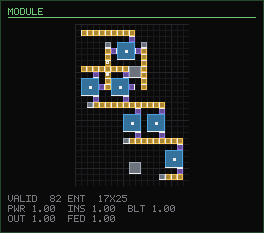
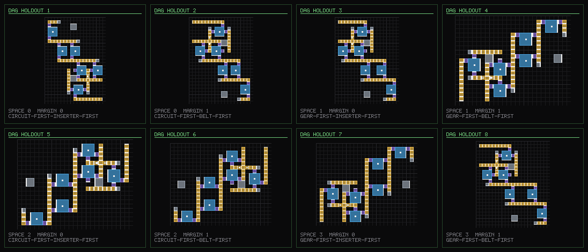

# Factorio: разбор прогона и куда двигаться дальше

Документ отвечает на issue #17: что показал прогон
`DESIGNS=20000 PROMPTS=48 BACKEND=vulkan examples/factorio.sh runs/nano`, есть ли
проблемы в обучении и в датасете, надо ли продолжать учить пространственную
грамматику, надо ли увеличивать модель — и какая у всего этого конечная цель.

Каждое число ниже либо взято из лога прогона в issue, либо получено скриптом из
`factorio/experiments/`, и тогда рядом сказано каким.

## 1. Короткий ответ

Прогон не провалился. Он **упёрся в потолок собственной метрики**: пять из шести
чисел равны 1.000, и оптимизировать больше нечего. Это выглядит как «модель
научилась», а на деле означает, что бенчмарк перестал различать хорошее и
плохое.

Проверяется это прямо: берём чертежи, которые грейдер называет безупречными,
ломаем в них ровно одну вещь и смотрим, заметит ли он. `grader_blindspots.py`,
200 бросков:

| порча | valid | quality | **perfect** | item-flow |
| --- | ---: | ---: | ---: | ---: |
| ничего не тронуто | 1.000 | 1.000 | 1.000 | 1.000 |
| один сборщик перенастроен на рецепт, который лента не везёт | 1.000 | 1.000 | **1.000** | 0.373 |
| один вставщик развёрнут задом наперёд | 1.000 | 1.000 | **1.000** | 0.422 |
| удалён вставщик, снимающий продукт | 1.000 | 1.000 | **1.000** | 0.422 |

`perfect` — доля чертежей, у которых **все** метрики того прогона равны 1.0.
Она равна единице во всех трёх строках: заведомо неработающая фабрика получает
идеальный балл. Значит, `quality 0.977` в логе — это не «почти идеально», это
«почти всё, что грейдер вообще способен увидеть».

Отсюда три вывода, и все три уже реализованы в PR #18:

1. **Метрику надо менять, а не догонять.** Появился грейдер потока предметов
   (`flow.py`): он не спрашивает «легально ли», он спрашивает «доедет ли медь до
   машины и уедет ли микросхема из зоны».
2. **Пространственную грамматику доучивать не надо** — она выучена (§3).
   Учить надо то, чего в корпусе не было: осмысленную связность.
3. **Модель увеличивать пока нельзя** — не потому что дорого, а потому что
   бюджет токенов уже превышает то, что корпус может сказать (§4).

Конечная цель — **компилятор**: детерминированный планировщик решает *что*
строить, модель решает *где это лежит*. Развёрнуто в §6.

Всё это проверено полным прогоном на GPU, а не только рассуждением: §5.5. Из
него одна строка — ярус легальности остался на 0.978, хотя корпус между
прогонами сменился на пятую часть содержанием, а новый ярус потока читает 0.611.
То есть старая метрика действительно упёрлась в потолок, а новая нет.

## 2. Что именно показал лог

```
parses                  1.000
valid                   0.979
spec honoured           0.896
powered                 1.000
inserters connected     0.995
belts lead somewhere    1.000
quality                 0.977
mean entities            37.9
```

Единственное число не у потолка — `spec honoured` (0.896). Оно проверяет, что
модель выдала запрошенные количество сущностей, ширину и высоту, и это
единственная часть метрики, где условие меняется от промпта к промпту. Всё
остальное — свойства, которые выполняются у почти любой аккуратно расставленной
кучи сущностей.

Валидационный лосс:

| шаг | 214 | 856 | 1712 | 2568 | 3424 | 4280 |
| --- | ---: | ---: | ---: | ---: | ---: | ---: |
| valid loss | 0.3768 | 0.1688 | 0.1443 | 0.1353 | 0.1337 | 0.1268 |

Сорок процентов прогона забирают 93% всего падения лосса (0.3768 → 0.1443).
Оставшиеся 2600 шагов срезают ещё 12% от достигнутого — до 0.1268.
Расхождения train/valid почти нет (финальные ~0.09–0.12 против 0.1268)
— то есть это **не переобучение**, это исчерпание задачи.

Самое говорящее число здесь — не лосс, а `bpb 0.0274`: 0.027 бита на байт. Для
сравнения, у естественного текста это порядка единицы. Корпус, который
трёхмиллионная модель сжимает в тридцать раз плотнее, чем текст, — это корпус,
в котором почти нет информации. Что логично: десять шаблонных генераторов с
несколькими ручками производят документы, почти полностью предсказуемые из
`<spec>`.

**Диагноз: обучение исправно, датасет и метрика — нет.**

## 3. Надо ли продолжать учить базовые правила Factorio

Нет. Точнее — они уже выучены, и это видно по тем же числам.

- `parses 1.000` — грамматика документа усвоена полностью;
- `valid 0.979` — непересечение прямоугольников разных размеров, сетка, легальные
  рецепты; ошибается на одном чертеже из пятидесяти;
- `powered 1.000`, `belts lead somewhere 1.000`, `inserters connected 0.995` —
  локальные пространственные правила усвоены до потолка.

Это ровно та «пространственная грамматика», ради которой писался первый корпус,
и модель на 3.5M параметров ей владеет. Продолжать её тренировать — значит
шлифовать 0.979 до 0.985 за счёт всего остального.

Оговорка, которая важна: `valid 0.979` держится на том, что корпус **не
содержит ни одного невалидного документа** — генераторы проверяются грейдером
до записи, и `rejected` в манифесте это аларм, а не допуск. Это свойство надо
сохранить при любом расширении корпуса; чертёж с обрезанным хвостом учит, что
`</bp>` необязателен, и валидность обваливается сразу.

## 4. Надо ли увеличивать модель

Пока нет, и это арифметика, а не осторожность.

После расширения словаря `factorio-nano` — 3.6M параметров, шиншилловый бюджет
20 токенов на параметр даёт 71.4M токенов обучения. Корпус разобранного прогона
— **9.17M** уникальных train-токенов. 71.4 / 9.17 = **7.8 эпох**. Законы
масштабирования при ограниченных данных
(Muennighoff et al., 2023) кладут точку, после которой повторение перестаёт быть
почти бесплатным, примерно на четырёх эпохах. То есть прогон уже вдвое глубже в
режиме повторов.

Увеличение модели двигает эту дробь в **худшую** сторону: вдвое больше
параметров — вдвое больше требуемых токенов — 15.6 эпох вместо 7.8. Ёмкость не
является связывающим ограничением; связывающее ограничение — количество разного,
что корпус может сказать, и наличие метрики, которая отличает выученное от
запомненного.

Насколько корпус исчерпан, меряет `experiments/saturation.py`: 3200 бросков от
каждого из одиннадцати генераторов дают 7579 различных раскладок, при этом шесть
из одиннадцати заканчиваются к четырёхсотому броску (у mining outpost всего 44
формы, у lab block — 56). До генератора модулей тех же бросков от десяти
генераторов хватало на 6344 раскладки — новый генератор сдвинул потолок на
пятую часть и единственный из одиннадцати сделал это, добавив новое содержание,
а не новый способ сказать то же самое. Потолок синтетики — около 12M токенов.
Человеческие чертежи с `factorioprints.com` добавляют ещё ~7.8M. Вместе 19.8M
против 17.9M, которые нужны для четырёх эпох, — то есть текущая связка едва-едва
дотягивает до режима, где повторы ещё безвредны, и только для модели этого
размера.

Вывод: **сначала данные и метрика, потом параметры**. Модель имеет смысл
увеличивать тогда, когда появится задача, в которой она измеримо не дотягивает —
и §6 описывает именно такую задачу.

## 5. Что было сделано по итогам разбора

### 5.1 Грейдер потока предметов

`flow.py` считает неподвижную точку по множествам предметов: что лежит на каждой
ленте, что доезжает до каждой машины, что машина может из этого сделать, что
вставщик может с неё снять. Правила взяты из игры, а не из интуиции: вставщик
смотрит на клетку, **в** которую кладёт, и берёт с противоположной; лента ведёт в
клетку, на которую смотрит; лента кормит только другую ленту, но не машину; на
ленте помещается максимум два вида предметов.

Оценка сознательно оптимистичная — throughput, стороны ленты и топливо не
моделируются. Она отвечает на вопрос «может ли предмет физически доехать», и
этого достаточно, чтобы отличить работающий модуль от декоративного, что и
показывает таблица в §1.

Новые числа отчёта: `delivers`, `fed`, `working`, `mixed`, `leaks`, `within_zone`
и `missing` — список предметов, которых не хватило. `flows()` считается **отдельно
от** `quality()` и не смешивается с ней: усреднение позволило бы одному спрятать
другое, чем и закончился разобранный прогон.

На график `metrics.png` `flow` выведен той же панелью, что `valid`, `parses`,
`spec` и `quality`, а не отдельной картинкой — ровно ради сравнения, которое
делает §5.5: четыре кривые лежат на потолке, пятая нет.

### 5.2 Планировщик

`plan.py` разворачивает «сделай микросхему из железной и медной пластины» в
цепочку рецептов и целые количества машин, читая `assets/prototypes.json` —
те же ингредиенты, времена крафта и скорости машин, что и в игре. Ни один
параметр сети на это не тратится: планировщик прав по построению там, где модель
была бы правдоподобно неправа, а перепутанное соотношение даёт фабрику, которая
выглядит идеально и голодает.

### 5.3 Модули, порты и план в промпте

Одиннадцатый генератор, `module`, ставит то, что насчитал планировщик: ряд лент,
ряд вставщиков, ряд машин, снова вставщики — и так по ступеням цепочки. Спека
выросла на две необязательные секции:

```
<bp> <spec> k:module r:electronic-circuit #5 #16 #20
  <in> i:copper-plate s:n x03 y00
  <in> i:iron-plate s:n x00 y06
  <out> i:electronic-circuit s:e x15 y12
  <plan> assembling-machine-1 r:copper-cable #2
         assembling-machine-1 r:electronic-circuit #3 </plan>
  </spec> <e> ... </bp>
```

Порт записан как **клетка внутри чертежа плюс сторона зоны**, а не как смещение
вдоль края. Две причины: клетка преобразуется при повороте ровно так же, как
сущность, поэтому аугментация не может рассинхронизировать порт с чертежом; и
модель уже знает, что такое `x03 y00`, тогда как смещение было бы третьей
системой нумерации той же формы.

Обе секции необязательны и отсутствуют во всех документах старых генераторов, так
что грамматика — надмножество прежней: корпус, смешивающий модули и ленточные
магистрали, обходится одним словарём и одной моделью. Словарь вырос с 495 до 657
токенов.

### 5.4 Раскладок стало столько, сколько стоит учить

Первая версия генератора модулей меняла только каталог и число машин — и
насыщалась на **45** различных чертежах. Причина в том, что дедупликация корпуса
идёт по `augment.canonical`, а он смотрит насквозь: тиры опускает до первого
уровня (быстрая лента → обычная, сборщик-2 → сборщик-1), повороты и отражения
сводит к минимуму по группе. То есть рандомизация тиров и поворотов не даёт
корпусу ничего.

`synth.Layout` выносит наружу то, что видно только через геометрию: зазор между
машинами, запас по краю, шаг электростолбов, выравнивание узкой ступени — плюс
направление каждой ленты, выбираемое **построчно** (перевернуть все ряды разом
это зеркало, которое аугментация и так делает; перевернуть один — это чертёж,
которого в корпусе нет).

Какие направления доступны — вопрос геометрии, а не вкуса, и это стоило двух
итераций отладки: лента отдаёт предметы только вниз по течению, поэтому ряд
обязан начинаться не позже самого левого получателя; а внутренний ряд
заканчивается столбом на клетку раньше края, и если там же стоит вставщик, он
тянется в столб вместо ленты. Оба правила проверяет `_directions`.

`experiments/module_yield.py`, 1600 бросков:

| бросков | 25 | 50 | 100 | 200 | 400 | 800 | 1600 |
| --- | ---: | ---: | ---: | ---: | ---: | ---: | ---: |
| различных раскладок | 25 | 50 | 92 | 156 | 271 | 460 | 760 |
| выход | 100% | 100% | 92% | 78% | 68% | 57% | 48% |

**760** раскладок против 45, 178k токенов до аугментации против 9.4k — почти
двадцатикратно, и кривая ещё не легла. Против шести из десяти старых
генераторов, которые заканчиваются к четырёхсотому броску, это единственный
генератор, который сейчас имеет смысл крутить дальше.

Главное отличие даже не в количестве: **у каждого модуля есть проверяемая
правильность**. Ленточная магистраль либо легальна, либо нет; модуль обязан
дополнительно *работать*, и это проверяемо, потому что спека говорит, что
подаётся и что должно выйти. Тест `test_every_module_draw_makes_the_item_it_advertises`
держит все 120 бросков на `delivers = fed = working = 1.0`.

### 5.5 Что сказал прогон на GPU

Всё выше — рассуждение; это его проверка. Тот же `examples/factorio.sh` с той же
конфигурацией, что в разбираемом логе, но на новом корпусе и с новым грейдером
(CI-прогон `30184124302`, self-hosted 16 GB, 29 минут из отведённых 75).

Корпус: 7473 различных раскладки, 54489 документов, **rejected 0**, 10.2M
обучающих токенов, словарь 657. Смесь — `real` 2058, `module` 1518,
`assembler-row` 993, `belt-lane` 922, `bus-tap` 787, `mall-cell` 522, остальные
шесть вместе 673. Генератор модулей стал вторым по величине источником корпуса
и первым среди синтетических.

Валидационный лосс — 4337 шагов, `final: loss 0.0721 | bpb 0.0154`:

| шаг | 216 | 1080 | 1944 | 2808 | 3672 | 4320 |
| --- | ---: | ---: | ---: | ---: | ---: | ---: |
| valid loss | 0.3270 | 0.0989 | 0.0897 | 0.0839 | 0.0769 | 0.0723 |
| bpb | 0.0698 | 0.0211 | 0.0191 | 0.0179 | 0.0164 | 0.0154 |

Форма кривой та же, что в §2 — 93% падения за первые 40% шагов, — и вывод из §4
она подтверждает: 10.2M токенов против 9.17M, лосс упал ниже прежнего (0.0721
против 0.1263), расхождения train/valid по-прежнему нет. Более разнообразный
корпус модель съела ещё легче, чем прежний. Увеличивать её по-прежнему не за что.

Оценка последнего чекпоинта, 48 промптов. Сам прогон напечатал этот блок в
старом формате и с ошибкой в средних (о ней ниже); ниже — то, что печатает
`grade` на тех же `samples-0004337.jsonl` после исправления, воспроизводится по
§7:

```
parses                  1.000      spec honoured           0.854
valid                   0.979      quality                 0.978
powered                 1.000      mean entities            40.8
inserters connected     0.998
belts lead somewhere    0.999

== ITEM FLOW [4 ported, 18 crafting, 18 scored of 48] ==
outputs delivered       1.000      designs leaking items    0.170
machines fed            0.611      belts over two items     0.021
machines working        0.611
flow score              0.611
inside the zone         1.000
```

Это и есть ответ на вопрос issue, в одной таблице. **Ярус легальности стоит там
же, где стоял** — `quality` 0.978 против 0.977 в разбираемом прогоне, при том
что корпус между прогонами сменился на пятую часть содержанием: одиннадцатый
генератор даёт 1518 раскладок из 7473, и это единственный вид, у которого есть
проверяемая правильность. Метрика, которая не двигается,
когда меняется всё остальное, ничего не измеряет; ради этого и писался
`flow.py`. **Новый ярус читает 0.611** — то есть почти у сорока процентов машин,
которые модель расставила, не доезжает хотя бы один ингредиент рецепта. Три
повтора того же прогона дали 0.562, 0.500 и 0.562, так что честная формулировка —
«примерно у половины»; о разбросе ниже. Здесь есть куда расти, и это
то самое место, где растёт то, ради чего всё затевалось.

Одно число просело — `spec honoured` 0.854 против 0.896. Это 41 промпт из 48
против 43 из 48, то есть разница в два примера при стандартной ошибке около
0.06: шум. Но и разбивка по видам говорит, что это не регресс — модули держат
4/4, промахиваются `belt-lane` 2/4, `mining-outpost` 2/4, `real` 3/4. Отложенная
выборка в этом прогоне впервые идёт круговым обходом по видам, поэтому в неё
попали человеческие чертежи и мелкие генераторы, у которых запрошенные ширина и
высота жёстче; прежняя выборка была префиксом смеси и таких почти не содержала.
Сравниваются не совсем одинаковые экзамены.

Насколько числа из этого блока вообще устойчивы, показали ещё три прогона —
тот же код, тот же CI, разная только недетерминированность вычислений
([30186447735](https://github.com/uselessgoddess/quasar/actions/runs/30186447735),
[30187400023](https://github.com/uselessgoddess/quasar/actions/runs/30187400023),
[30188328334](https://github.com/uselessgoddess/quasar/actions/runs/30188328334)):

| | этот | 2-й | 3-й | 4-й |
| --- | ---: | ---: | ---: | ---: |
| `final loss` | 0.0721 | 0.0728 | 0.0724 | 0.0728 |
| `quality` | 0.978 | 1.000 | 0.937 | 0.958 |
| `spec honoured` | 0.854 | 0.792 | 0.792 | 0.771 |
| `flow score` | 0.611 | 0.562 | 0.500 | 0.562 |

Лосс повторяется в третьем знаке. Метрики оценки — нет: `flow` разъезжается на
0.11 при среднем 0.56, и это не шум измерения, а размер выборки. Лосс считается по 327 680
токенам, `flow` — по шестнадцати раскладкам; шестнадцать раскладок это ±0.12 на
одно стандартное отклонение, ровно то, что видно. Поэтому **правильно читать
этот ярус как «половина машин с небольшим», а не как 0.611**, и сравнивать
прогоны имеет смысл по разнице больше 0.1. И поэтому же пункт 2 дорожной карты
(перевесить валидацию в сторону модулей) — про доверие к метрике, а не про
удобство: сейчас ярус, ради которого всё затевалось, меряется на шестнадцати
примерах из сорока восьми.

Две оговорки, обе честные.

`4 ported` — из 48 промптов только четыре были модулями. Отложенная выборка уже
идёт круговым обходом по видам (`dataset._write_prompts`), поэтому это ровно
48/12: видов двенадцать, а порты объявляет один из них. `outputs delivered 1.000`
на четырёх примерах это скорее «не сломано», чем «решено». Круговой обход по
видам был правильным ответом, пока модули были одним генератором из
одиннадцати; теперь, когда именно они несут единственную метрику с запасом
хода, отложенную выборку стоит перевесить в их сторону. Это пункт 2 дорожной
карты, и прогон подтверждает, что он не косметический: `generate` съел 647
секунд из 1787, а из 48 промптов 44 не проверяют портовый контракт вовсе и 30
не попадают ни в один знаменатель потока — то есть больше половины самой
дорогой стадии уходит на ярус, который и так читает 1.000.

Знаменатели на линейке появились не сразу. Первый печатный прогон дал
`machines fed 0.234`, и это была ошибка агрегирования, а не результат: `fed` —
дробь с числом машин в знаменателе, и `flow.trace` честно возвращает 0.0, когда
машин нет вообще. Усреднение по всем валидным чертежам подмешивало в среднее
ленточные магистрали и балансиры как «неработающие машины», и число получалось
про состав бенчмарка. Ровно та ошибка, которую эта записка вменяет старым
метрикам, — поэтому `Report.asks_about_flow()` и три знаменателя на линейке.

### 5.6 Модуль как основная задача, а не одиннадцатый генератор

Всё выше писалось про корпус, в котором модуль — один генератор из одиннадцати.
Прогон §5.5 сказал, чем это плохо: ярус легальности стоит на 0.978 и учиться на
нём нечему, а единственная метрика с запасом хода меряется на четырёх промптах
из сорока восьми. Дальше — что с этим сделано, в порядке коммитов.

**Научные пакеты перестали быть жидкостями.** В каталоге модулей не было ни
одной научной цепочки, и это выглядело как цепочка, отбракованная фильтрами
раскладки. На самом деле планировщик её не видел. `is_fluid` означало «у
предмета нет размера стака», а таблица предметов дистиллировалась только из
`data.raw.item` — тогда как Factorio держит научный пакет в `tool`, патрон в
`ammo`, модуль в `module`, машину в `item-with-entity-data`. 61 предмет из 214,
которые называют ванильные рецепты, оставался без размера стака, то есть
считался жидкостью, а `chains` пропускает жидкости молча. Теперь `stacks()`
собирает размер стака из любой категории прототипов, где это поле есть, а
жидкости читаются отдельным списком из `data.raw.fluid`: «это жидкость» и «этот
прототип не дистиллировали» перестали быть одним утверждением. Каталог модулей
**20 → 24**, среди них красная наука. Словарь — 657 → 739 токенов, то есть ~16k
параметров из 3.6M.

**Цепочка стала графом.** Раньше план обязан был укладываться в полосу рядов:
каждая ступень берёт то, что приехало снаружи, плюс продукт ряда над ней. Это
условие резкое — лента отдаёт предметы вниз по течению и никуда больше, поэтому
у `fast-underground-belt` шестерни проехали бы мимо ряда, который их ждёт
(грейдер и ловил это как `fed` 0.67). `plan.fork` разбирает план на две ветви,
сходящиеся на последней ступени: последняя ступень потребляет ровно два
предмета, оба сделаны здесь же, а предшествующие ступени распадаются на два
непересекающихся прогона, каждый из которых сам укладывается в полосу.
`Module.shape` называет, какая из двух раскладок выражает план, и выводится из
плана, а не выбирается. Каталог **24 → 29**, из них пять ветвящихся на
`depth=4`: котёл из камня и железной пластины, быстрая подземная лента из
пластины и обычной ленты, капсула-разрушитель, ремонтный набор из пластины и
медного кабеля — и он же на шаг глубже, из пластины и медной пластины.

На этом этапе зелёная наука в каталог ещё не входила, и это был честный
предел тогдашней раскладки. Причин две, и ветвление не лечило ни одну: шестерня кормит обе ветки, то
есть это ромб, а не две независимые колонки; и вставщику нужны микросхемы,
шестерни *и* железная пластина — три вида предметов на ленте, которая держит
два. Первое чинится общим промежуточным, разведённым вбок, второе — второй
лентой на машину. Записано тестом
`test_green_science_gets_a_factory_layout_for_both_hard_reasons`, который
сначала воспроизвёл этот предел и затем стал критерием следующего шага.
Оговорка к формулировке пункта 3 дорожной карты:
«микросхема + шестерня» — это рецепт вставщика, а не научного пакета; сам
`logistic-science-pack` собирается из вставщика и ленты. Красная наука в каталог
вошла, но не как схождение веток: шестерню она делает здесь, а медная пластина
приезжает по ленте, то есть это полоса. Схождение — те пять модулей выше.

**Раскладка из двух сходящихся колонок.** `synth._forked` ставит каждую ветвь
своей колонкой с собственными лентами, обе колонки выровнены по низу и отдают
продукты на одну ленту, под которой стоит последняя машина. Две колонки, а не
одна широкая, — это ещё и то, что держит полосы честными: ближняя ветвь может
просить медную пластину, дальняя железную, и одна лента через обе несла бы
объединение, то есть ровно то, что `plan.modules` ограничивает двумя видами на
ленту. Ближняя ветвь везёт сырьё на восток от левого края, дальняя на запад от
правого, так что обе головы лежат на границе и объявляются портами, а два
прогона встречаются нос к носу у общего столба посередине.

**Смесь перевешена в сторону модулей.** Веса генераторов были назначены на глаз;
теперь они прочитаны с `experiments/saturation.py`. Три генератора выдыхаются
почти сразу — у `mining-outpost` 44 формы, у `lab-block` 56, у `smelter-column`
68, и все три исчерпаны к четырёхсотому броску, — так что бросок в них стоит
бросок и не добавляет ничего. Половина смеси уходит модулям (`--module-weight`,
по умолчанию 0.45); остальные сохраняют пропорции между собой. Заодно расширены
диапазоны `synth.Layout` — расстановка это единственная ось, сквозь которую
`augment.canonical` не смотрит, поэтому она и решает, сколько различных схем в
генераторе вообще есть.

`build --count 20000` без человеческих чертежей, до правки и после:

| | до | после |
| --- | ---: | ---: |
| различных раскладок | 5777 | **10599** |
| из них модулей | 1880 | **4353** |
| обучающих токенов | 9.50M | **14.42M** |
| отбраковано | 0 | 0 |

Вклад двух половин правки разделяется: одни веса, при прежних диапазонах
`Layout`, дают по проекции `saturation.py` 7570 раскладок и 2826 модулей —
остальное добавляет расстановка. (В теле коммита эта проекция названа числом
«до»; правильное «до» — 5777 и 1880, замер выше.)

`experiments/module_yield.py` на 1600 бросках: **1164** различных раскладки
против 760 в §5.4 и 289k токенов до аугментации против 178k, выход 73% против
48% — кривая не только не легла, она стала положе.

**Оценка модулей отдельно от стенда.** Средние по бенчмарку прячут ровно ту
задачу, ради которой всё делается: десять генераторов из одиннадцати выходят
легальными уже на первом чекпойнте, и модуль, который ничего не доставляет,
сдвигает `quality` на сороковую часть. Поэтому `grade --kind module` берёт срез
по генератору и печатает его под своей чертой `== GRADE MODULES ==`, а
`plot --kind` рисует по этому же срезу отдельную панель — `delivers`, `fed`,
`working` по чекпойнтам, рядом с loss и ppl. Поле `kind` едет вместе с
генерацией, потому что `generate` копирует в неё запись промпта, так что ничего
не приходится сопоставлять со спекой вручную. Чекпойнт, в промптах которого
модуля не было, в кривую не попадает: модель, у которой модуля не просили, его
не провалила, а ноль нарисовал бы обратное. `examples/factorio.sh` заодно
сохраняет лучший модуль отдельным блюпринтом — по всей смеси ранжирование
выбирает победителя из десятков образцов с одинаковым идеальным счётом, где
решает уже счётчик сущностей, так что `best.png` может не показать ни одной
попытки в целевой задаче.

Чего в этом разделе нет — цифр обучения. Всё перечисленное меряется на корпусе и
на стенде; растёт ли `delivers` от чекпойнта к чекпойнту, может сказать только
полный прогон на карте, и это первое, что стоит посмотреть в артефактах
следующего зелёного `blueprints`.

### 5.7 Фиксированный baseline и первый многоленточный DAG

Прежний прогон отвечал на вопрос о модулях по пяти случайным примерам. Итог
`1.000` при `n=5` не был устойчивым baseline: следующий seed мог выбрать другие
цели, а повтор одного промпта ошибочно выглядел бы независимым наблюдением.
Теперь `benchmark.jsonl` — отдельный, версионированный `module-v1`: **64
фиксированных промпта**, все 29 целей предшествующего каталога минимум по два
раза, пять ветвящихся страт по три раза и один дополнительный эталонный
`electronic-circuit`. Точные эталонные раскладки резервируются до записи
`train`/`valid`, поэтому аугментированная копия теста не может попасть в
обучение.

Каждый чекпойнт генерирует весь набор с независимыми записанными
`sampling_seed`; `benchmark` отказывается оценивать неполный набор, повтор seed
или изменённую спецификацию. 95%-й интервал строится вложенным bootstrap:
сначала по целям и промптам внутри shape-страт, затем по генерациям одного
промпта. Это сохраняет правильную единицу наблюдения и не превращает два
стохастических ответа на один вопрос в два новых вопроса. Набор намеренно
закреплён на 29 старых целях: добавление следующей возможности не сдвигает
baseline задним числом.

Следующая возможность — `logistic-science-pack` из железной и медной пластины,
теперь тридцатая цель live-каталога. Это не универсальный укладчик DAG, а
явная проверяемая геометрия для первого сложного случая:

- медь идёт в кабель, кабель и верхнее железо — в микросхемы;
- шестерни с той же верхней ленты уходят в обе средние ветки;
- отдельная нижняя железная лента даёт вставщику третий ингредиент;
- продукты веток сходятся к финальному сборщику, одна ветка пересекает нижнее
  железо парой подземных лент.

У схемы два входных порта железа, отдельный вход меди и выход зелёной науки.
Тесты по всем формам требуют одновременно `delivers=fed=working=1`,
`mixed=leaks=0`; эталоны занимают от 17×25 до 21×25 клеток и от 82 до 90
сущностей. Самый длинный документ вместе с EOS — 508 токенов из 512.



### 5.8 Один DAG как семейство геометрий

Первый вариант `factory` менял порядок только двух средних машин. Поворот,
отражение и тир ленты `augment.canonical` намеренно считает той же раскладкой,
поэтому сотни бросков генератора сводились к **двум** обучающим геометриям.
Модель видела ромб, но фактически могла запомнить две картинки. Это и есть
корневая причина, почему добавление одной правильной схемы ещё не учит
пространственному потоку как правилу.

`FactoryForm` выносит четыре независимые оси, которые переживают
каноникализацию:

- четыре расстояния между верхними машинами;
- два запаса ленты у внешнего края;
- два порядка микросхем и шестерён;
- два порядка вставщика и транспортной ленты.

Итого один и тот же recipe DAG имеет **32 канонические формы**. Все они проходят
полный контракт генератора: blueprint валиден и запитан, ленты и вставщики
соединены, `delivers=fed=working=1`, `mixed=leaks=0`. На 64 случайных бросках
`experiments/dag_catalogue.py` теперь получает 27 различных раскладок (42%
выхода); до параметризации тот же замер давал 2 из 64 (3%).

Нельзя просто объявить все 32 формы тестовыми: `dataset.build` резервирует
канонические references, и тогда весь новый DAG исчез бы из train. Поэтому
`dag-v1` использует дробный holdout. Восемь комбинаций четырёх осей полностью
зарезервированы, остальные 24 остаются в обучении; каждый holdout-маршрут
задаётся четырьмя независимыми положениями портов/ориентациями. Это 32
фиксированных prompt, но только восемь удержанных геометрий. Каждое значение
каждой отдельной оси встречается в train — неизвестна именно их комбинация.

`examples/factorio.sh` генерирует `dag-samples-<step>.jsonl` на каждом
чекпойнте, проверяет полноту и неизменность набора, сохраняет
`dag-benchmark.json`, `dag-failures.png`, лучший `best-dag.png` и отдельную
`dag-metrics.png`. Последняя показывает `delivers`, `fed`, `working` и `flow`
по ходу обучения именно на фабричной shape, не растворяя один DAG в 29 старых
целях.



Второй DAG намеренно не добавлен в тот же эксперимент: одновременно менять
семантический граф и разнообразие его укладки означало бы не знать, что
сдвинуло flow. `experiments/dag_catalogue.py` уже ранжирует 133 ещё не
размещённых кандидата по общим промежуточным и арности; среди малых следующих
ступеней — `power-switch`, `small-lamp` и `fast-inserter`. Их стоит добавлять
после ответа `dag-v1`: если flow растёт, расширять каталог графов; если нет —
переходить к обучению на reward грейдера.

### 5.9 Constrained sampling против reject/regenerate

На заранее выбранном первом чекпойнте один и тот же `module-v1` теперь проходит
двумя путями. В baseline-прогоне это заведомо ненасыщенная точка: valid 92,2%,
spec 91,3%, flow 72,6%; последний чекпойнт уже достигает соответственно 99,2%,
100% и 96,9% и скрыл бы почти весь эффект жёстких ограничений. Выбор первого
чекпойнта записан до чтения результатов текущего прогона, поэтому A/B не ищет
удобную точку задним числом.

Constrained decoder маскирует следующий токен до sampling: синтаксис, выход за
объявленную зону, пересечения footprint, несовместимый рецепт и неверную арность
полей. Состояние обновляется по одному токену, а таблица геометрии и допустимых
рецептов записывается корпусом в `constraints.json`. Планировщик при этом
остаётся front end: prompt уже содержит точную цепочку и порты, модель выбирает
размещение, decoder не подменяет её готовым шаблоном.

Контрольный путь получает две обычные генерации каждого фиксированного prompt и
выбирает первую, которая одновременно парсится, валидна и соблюдает spec; если
обе неудачны, сохраняется последняя. Отчёт не прячет цену выбора:
`attempt_budget` считает все реально сгенерированные ответы (128 против 64),
`attempts_used` показывает, где мог бы остановиться последовательный online
reject. `inference.json` рядом выводит одинаковые quality/flow метрики и те же
стратифицированные интервалы benchmark для обоих методов. Поэтому следующий
GPU-прогон отвечает отдельно на два вопроса: сколько ошибок можно
предотвратить конечной грамматикой и стоит ли остаточный прирост качества
двукратного inference compute.

## 6. Куда двигаться: модель как back end компилятора

Вопрос из issue сформулирован точно: «может планировщик должен модели помогать —
модель просто размещает, а код знает все рецепты». Ответ — да, и это не костыль,
а правильное разделение.

**Планировщик — front end, модель — back end.** Планировщик отвечает на вопрос
«что построить»: из медной пластины делается медный кабель, из кабеля и железной
пластины — микросхема, и три кабельные машины кормят две микросхемных, потому
что так говорят рецепты. Это арифметика с точным ответом, известным заранее.
Тратить на неё параметры сети — значит покупать вероятностную версию того, что
уже есть в виде таблицы, и получать фабрики, которые выглядят правильно и
голодают.

Модель отвечает на вопрос «где это лежит»: как уложить пять машин, восемь
вставщиков и три ленты в зону 16×20 так, чтобы ничего не пересекалось, всё было
запитано, и предметы физически доезжали. Здесь точного ответа нет, задача
комбинаторная, и именно она стоит нейросети.

План едет в промпте (`<plan>`), так что модель **обусловлена** соотношениями, а
не изобретает их. Заодно это готовит следующий шаг: план записан и в обучающий
документ тоже, поэтому более крупного члена семейства можно будет попросить
выдать план самостоятельно и сравнить с ответом планировщика — то есть проверить,
выучил ли он рецепты, не рискуя при этом работоспособностью модулей.

### Явные порты на сетке — это правильно

Второй вопрос из issue: «может вообще явные размещённые входы/выходы на grid это
не круто». Нет, круто, и вот почему.

Порт — это **контракт композиции**. Модуль с входами где-то в середине не может
пообещать ничего: его нельзя приставить к соседнему модулю, потому что ленты не
сойдутся. Модуль, объявивший «медь заходит на клетку x03 y00 с северного края»,
— может, и два таких модуля стыкуются механически.

Это же превращает пользовательский сценарий из issue в конкретную задачу: человек
выделяет зону N×M, ставит `input[iron plate]`, `input[copper plate]`,
`output[electronic circuit]` — это ровно `<in>`/`<out>` в спеке; планировщик
разворачивает цепочку в `<plan>`; модель заполняет зону. Никакой отдельной
инфраструктуры под это не нужно, сценарий уже выражается в текущей грамматике.

Альтернативы, которые рассматривались и хуже:

- *Порты как смещения вдоль края* — третья система нумерации с той же формой, что
  и координаты, и она ломается при повороте: аугментация рассинхронизирует порт с
  чертежом.
- *Порты без указания стороны, просто клетка* — модуль перестаёт стыковаться, а
  грейдер потока не может отличить «продукт уехал через объявленный выход» от
  «продукт утёк с края».
- *Никаких портов, только «сделай микросхемы»* — это и есть текущий прогон, где
  метрика ослепла. Без объявленного входа нельзя сказать, чем фабрика питается,
  а значит нельзя проверить, работает ли она.

### Дорожная карта

Ближний порядок — то, что делает следующий прогон осмысленным, — закрыт в
§5.6–5.9:
модуль стал основным генератором (45% смеси), оценка модулей вынесена из средних
по стенду в свой срез и свою панель, а цепочка перестала быть полосой и стала
графом с ветвлением. Фиксированный baseline отделён от live-каталога, а зелёная
наука закрывает первый ромб с общим промежуточным и второй входной лентой.
Constrained sampling и reject/regenerate теперь измеряются на одних 64 prompt с
явной ценой всех попыток.

Следующий порядок — то, что решают данные этого A/B:

1. **Выбрать inference policy.** Оставить конечную грамматику как дешёвую
   гарантию синтаксиса и геометрии; reject/regenerate добавлять только если
   `inference.json` покажет прирост flow, оправдывающий дополнительные попытки.
2. **Обучение на сигнале грейдера.** Если `flow` перестанет расти от корпуса,
   это естественный reward: он вычисляется мгновенно, не требует запуска игры и
   не гейммится локальными метриками (§1 — доказательство от противного).
3. **Увеличение модели — здесь, а не раньше.** К этому моменту у задачи будет
   метрика, которая не насыщается, и корпус, который не кончается за четыре
   эпохи. Тогда рост параметров можно будет обосновать числом, а не ощущением.

### К чему стремимся, одной фразой

Пользователь выделяет зону и говорит, что в неё заходит и что должно выйти.
Планировщик считает цепочку рецептов. Модель раскладывает её по клеткам так, что
результат можно вставить в игру и он заработает — и «заработает» проверено
грейдером до того, как человек это увидит.

## 7. Как это воспроизвести

```sh
cd factorio

# насколько грейдер прошлого прогона слеп
PYTHONPATH=src python3 experiments/grader_blindspots.py 200

# сколько разного умеет генератор модулей
PYTHONPATH=src python3 experiments/module_yield.py 1600

# сколько форм у принятого DAG и какие сложные DAG планировщик ещё не размещает
PYTHONPATH=src python3 experiments/dag_catalogue.py 64 20

# работают ли модули, которые он рисует
PYTHONPATH=src python3 experiments/module_flow.py 60

# где кончаются генераторы — и во что это складывается при весах смеси
PYTHONPATH=src python3 experiments/saturation.py

# какие цепочки умеет планировщик и сколько из них ветвящиеся/фабричные
PYTHONPATH=src python3 -c 'from quasar_factorio import plan, prototypes
ms = plan.modules(prototypes.load(), depth=4)
print(len(ms), sum(m.shape == "fork" for m in ms),
      sum(m.shape == "factory" for m in ms))'

# во что обходится сборка корпуса и где у неё горячие точки
PYTHONPATH=src python3 experiments/corpus_cost.py 400

# та же сборка, но одной ревизии против другой
cd .. && git worktree add --detach /tmp/wt-main upstream/main
factorio/experiments/corpus_ab.sh /tmp/wt-main main
factorio/experiments/corpus_ab.sh . branch
```

Прогон из §5.5 целиком — полчаса на 16 GB, ровно то, что гоняет CI:

```sh
python3 factorio/tools/fetch_blueprints.py --count 6000
DESIGNS=20000 PROMPTS=48 BACKEND=vulkan examples/factorio.sh runs/nano
```

Оценку последнего чекпоинта без повторного обучения можно получить из артефакта
`blueprints` любого зелёного прогона CI:

```sh
gh run download 30186447735 --repo uselessgoddess/quasar -n blueprints -D /tmp/nano
cd factorio && PYTHONPATH=src python3 -m quasar_factorio.cli grade \
    /tmp/nano/samples-0004337.jsonl

# то же, но только по модулям — срез из §5.6
PYTHONPATH=src python3 -m quasar_factorio.cli grade \
    /tmp/nano/samples-0004337.jsonl --kind module
```
